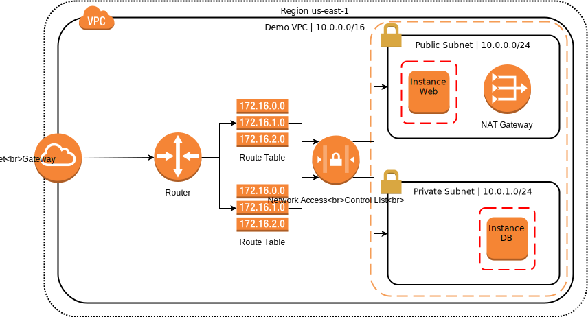

# VPC Demo

This terraform project creates a VPC with some default components including:

* Internet gateway
* Route tables
* Network ACLs
* NAT gateway
* Private subnet
* Public subnet
* EC2 instances in each subnet

